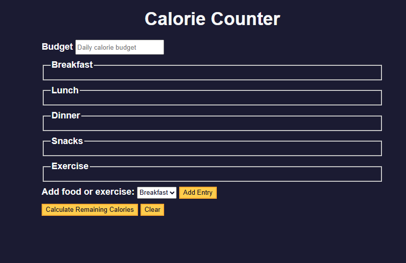

# 🥗 Calorie Counter Web App

A fully interactive **Calorie Counter Web Application** built using **HTML, CSS, and Vanilla JavaScript**.  
This project allows users to track their daily calorie **budget**, **food intake**, and **exercise**, while automatically calculating whether they are in a **calorie surplus or deficit**.

This project teaches important core web development concepts such as:
- DOM Manipulation
- Event Handling
- Regular Expressions (Regex)
- Dynamic UI Updates
- Template Literals
- Input Validation

---

## 📌 Project Overview

The Calorie Counter helps users:

✅ Set a daily calorie budget  
✅ Add food items and calories for:
- Breakfast
- Lunch
- Dinner
- Snacks

✅ Add exercise calories burned  
✅ Automatically calculate:
- Total calories consumed
- Total calories burned
- Remaining calories
- Surplus or deficit status

✅ Clear the form and reset the application instantly

---

## ✨ Features

### ✅ Dynamic Entry Creation
Users can dynamically add multiple food and exercise entries by selecting a category and clicking **Add Entry**.

### ✅ Real-Time Validation
All user inputs are validated using **Regular Expressions**, preventing invalid formats such as:


### ✅ Automatic Calculations
The app calculates:
- Consumed calories
- Remaining calories
- Surplus or deficit status

### ✅ Visual Feedback
- Surplus values are highlighted in **pink**
- Deficit values are highlighted in **green**

### ✅ Reset Functionality
Users can clear all inputs and reset the UI with a single click.

---

## 🧠 How It Works

### 1. Dynamic Input Creation
Every time the user clicks **Add Entry**, new fields are generated dynamically using JavaScript template literals.

### 2. Cleaning Input Data
Before calculations, all user input is cleaned using this regex:

```js
/[+-\s]/g


calorie-counter/
│
├── index.html        # Main HTML layout
├── styles.css        # UI styling
├── script.js         # Application logic
└── README.md         # Project documentation


