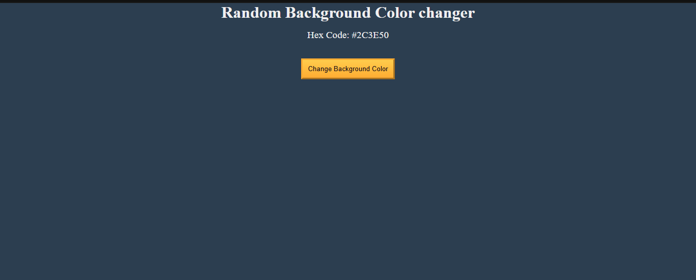

# 🎨 Random Background Color Changer

The **Random Background Color Changer** is a small, self-contained web project built with **HTML, CSS, and JavaScript**.

When the user clicks the **“Change Background Color”** button:

1. The app picks a **random color** from a predefined list of dark colors.
2. The **page background** is updated to that color.
3. The **Hex code text** displayed on the page is updated to match the new background.

This makes it a great mini-project for practicing:

- DOM selection and manipulation  
- Handling click events  
- Using arrays and random index generation in JavaScript  

---

## 📸 Project Preview

Below is a preview of what the app looks like when running:




---

## 📂 Project Structure

The project is intentionally kept simple and minimal:

```text
random-background-color-changer/
│
├── index.html      # Main HTML file – structure of the page
├── styles.css      # CSS file – styles and layout
├── script.js       # JavaScript file – app behavior and logic
└── image.png       # Screenshot / preview image used in this README
